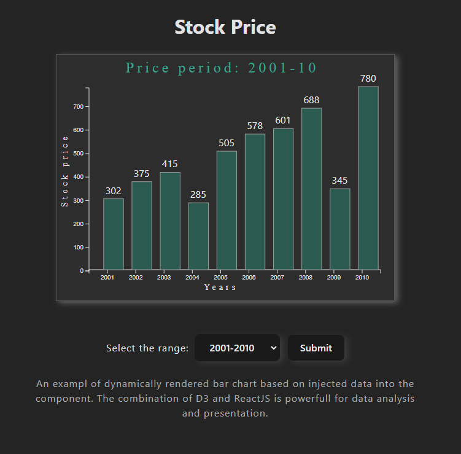

# Data Visualization Application using ReactJS, D3JS, TypeScript

## Overview:

This ReactD3Charts application showcases my skills in ReactJS with Vite and Typescript, as well as my proficiency in data visualization using D3.js. The application serves as a platform to present and dynamically visualize data in the form of a bar chart. It is designed to be highly customizable and extensible, allowing for the integration of various data sources through APIs.

## Features

- Utilizes ReactJS with Vite and Typescript for efficient development and enhanced type safety.
- Employs D3.js for data-driven visualization, allowing for dynamic rendering of bar charts.
- Supports customization and integration with external APIs for fetching data, enabling dynamic data visualization.
- Suitable for presentation and analytical purposes, offering a visually appealing and interactive way to represent data.

## Technologies Used

- ReactJS
- Vite
- Typescript
- D3.js
- ESLint
- Prettier

## Getting Started

To get started with the application, follow these steps:

1. Clone the repository to your local machine.
2. Navigate to the project directory.
3. Install dependencies using npm or yarn.
4. Run the application using the provided scripts.

## Usage

The application can be used as follows:

1. Launch the application in your browser.
2. Explore the provided data visualization features, including dynamic bar chart rendering.
3. Customize and extend the application as needed, leveraging the provided technologies and architecture.
